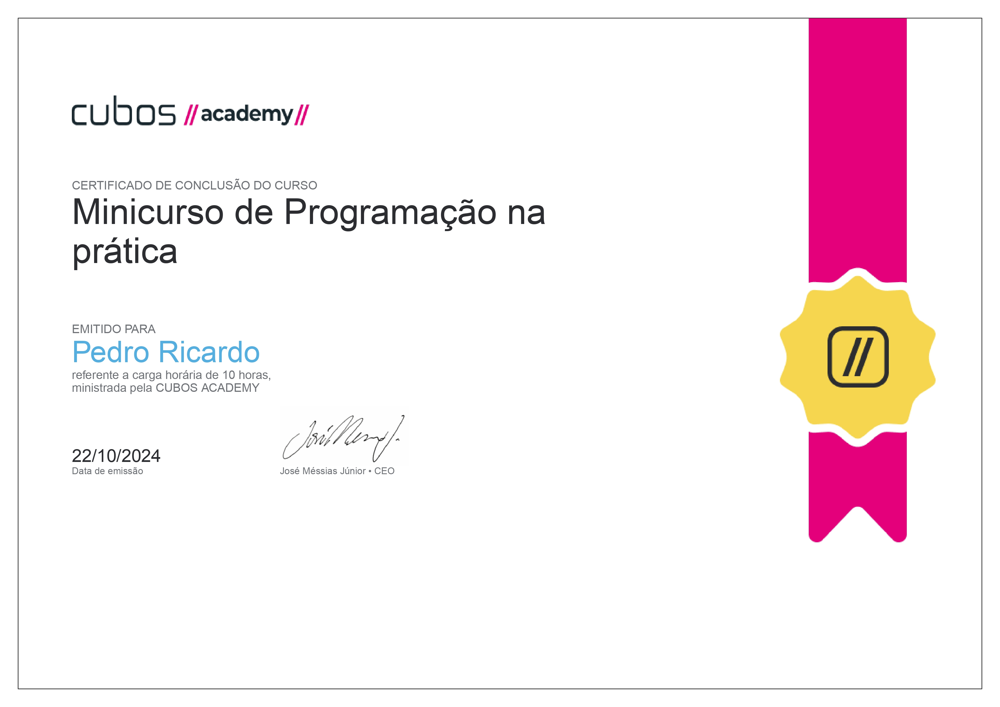

# Projeto Teach me Cubos Academy
Projeto de um site para estudos, com a utilização de HTML, CSS, Javascript, React e integração com o ChatGPT
Este epositório contém o material e os exemplos do Curso de Programação na Prática oferecido pela Cubos Academy. 
O curso tem como objetivo ensinar os fundamentos do desenvolvimento web, incluindo conceitos de programação e o uso da inteligência artificial 
para a criação de um projeto, chamado 'Teach.me', onde o usuário pode escolher temas para estudar ou ainda escolher temas prontos. 
O curso é bastante amplo, são muitas horas de prática e com vídeo-aulas incríveis!

## Conteúdo

- HTML
- CSS
- Lógica de programação
- Javascript
- React
- Integração com IA (inteligência artificial)

## Tecnologias Utilizadas

- HTML5
- CSS3
- ChatGPT
- React
- Javascript
- Node.js (npm)

## Como Executar

### Pré-requisitos
#### Visual Studio - Você pode fazer o download [aqui](https://visualstudio.microsoft.com/pt-br/downloads/).
#### Node - Você pode fazer o download [aqui](https://nodejs.org/pt/download/package-manager)
#### React - Você pode aprender como instalar [aqui](https://react.dev/learn/installation)

### Recomendação
#### Utilização da extensão do visual code: Live Preview ou Live Server (Five Server)

### Instalação

1. Clone este repositório:
   ```bash
   git clone https://github.com/pedrordcampos/Mini-Curso-de-Python---Rocketseat.git](https://github.com/pedrordcampos/Curso-de-Programacao-na-Pratica-Cubos-Academy.git

2. Instale as dependências
   ```bash
   npm install react@18.2.0 react-dom@18.2.0 @types/react@18.2.37 @types/react-dom@18.2.15
3. Instale o ChatGPT no projeto
   ```bash
   npm install openai

### Dúvidas? Entre em contato
#### Pedro Ricardo de Campos - Whatspp (15) 99752-3275
#### E-mail: pedro.rdcampos@hotmail.com
#### Linkedin: https://www.linkedin.com/in/pedro-ricardo-de-campos/

# 


